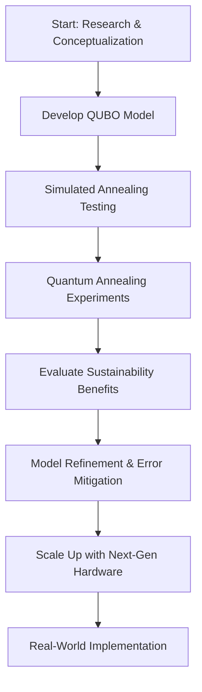

# Optimizing the Panama Canal: A Quantum Approach to Water-Saving Ship Scheduling

**Summary:**  
This blog post explores a groundbreaking study that addresses water scarcity at the Panama Canal through an optimized ship scheduling system. By leveraging a Quadratic Unconstrained Binary Optimization (QUBO) framework and advanced quantum computing methods—including quantum annealing and simulated annealing—the project demonstrates how water-saving measures such as cross-filling, tandem lockages, and innovative scheduling can reduce freshwater consumption by up to 40%. We dive into the mathematical formulation, quantum integration, simulation results, and discuss the sustainability, economic, and environmental benefits of this approach.

## Introduction

The Panama Canal is a vital maritime route that shortens shipping distances between the Atlantic and Pacific Oceans. However, in the face of increasingly severe droughts, water scarcity threatens both canal operations and local water supplies. This study introduces a novel timetable that integrates water-saving measures into the scheduling of ships. The approach not only conserves water but also minimizes CO₂ emissions and improves overall operational efficiency.

### Background

- **Climate Change & Drought:**  
  Increasing drought frequency, driven by climate change, has led to critical water shortages at Gatún Lake—the primary freshwater source for the canal and surrounding communities.
  
- **Panama Canal Operations:**  
  Traditional operations involve sequential lockages that consume vast amounts of water. The proposed solution rethinks this process by allowing multiple ships (via tandem lockages and cross-filling) to transit concurrently under optimized schedules.


   _Figure 1. Panama Canal Lock Standards (Image by Wikimedia Commons contributors, 2016, via Wikimedia Commons "Ship measurements comparison")._


  
_Figure 2. Cross filling the Miraflores locks (Image by Scope of Work, 2025, via Scope of Work, "Panamaximization")._

## Theoretical Foundations

### Quadratic Unconstrained Binary Optimization (QUBO)

The heart of the optimization problem is formulated as a QUBO. Mathematically, it is defined as:

$$
f_Q(x) = x^T Q x = \sum_{i=1}^{n}\sum_{j=i}^{n} Q_{ij} x_i x_j \quad \forall x \in \{0,1\}^n
$$

Here, \(Q\) is the matrix that encodes both the rewards (benefits of scheduling a ship) and penalties (water usage and infeasibility constraints).

### Mapping to Ising Models

QUBO problems are mapped to Ising models by transforming binary variables \(x\) into spin variables \(\sigma\) using \( \sigma = 2x - 1 \). This yields an Ising Hamiltonian:

$$
H = \sum_{i,j} J_{ij} \sigma_i \sigma_j + \sum_i h_i \sigma_i
$$

This mapping is critical for leveraging quantum annealing techniques.

### Quantum Annealing and Neutral Atom Quantum Computers

Quantum annealing is used to find the minimum-energy solution by evolving the system from an initial Hamiltonian \(H_0\) to the problem Hamiltonian \(H_P\) following:

$$
H(s) = (1-s) H_0 + s H_P, \quad s=\frac{t}{T}, \quad t\in[0,T]
$$

Neutral atom quantum computers provide an analog platform where each atom acts as a qubit. Control parameters like the Rabi frequency \(\Omega(t)\) and detuning \(\delta(t)\) steer the system toward the ground state.

> **Figure 3 from the Document:**  
>   
> _Figure 3. Neutral Atom Rydberg Radius Implementation (Image by Pasqal)._

> **Figure 4 from the Document:**  
>   
> _Figure 4. Neutral Atom Quantum Computer (Image by Pasqal)._

## Mathematical Formulation of the Scheduling Problem

The scheduling problem involves assigning \(N\) ships to \(T\) time slots. We define the binary variable:

$$
x_{i,t} = \begin{cases} 
1 & \text{if ship } i \text{ is scheduled in time slot } t, \\
0 & \text{otherwise.}
\end{cases}
$$

The overall Hamiltonian comprises several components:

1. **Linear Terms:**  
   These terms incorporate the benefits of ship assignments, water costs per slot, and penalties when a ship's length exceeds lock capacity:

   $$
   Q_{\text{linear}} = \sum_{i=0}^{N-1}\sum_{t=0}^{T-1} \left[ -\lambda_{\text{benefit}} B_i + \lambda_{\text{water}} W_t + \mathbb{I}\{L_i > K_t\}P \right] x_{i,t}
   $$

2. **Ship Scheduling Constraints:**  
   A quadratic penalty ensures each ship is scheduled at most once:

   $$
   \lambda_{\text{ship}} \left(\sum_{t=0}^{T-1} x_{i,t} - 1\right)^2
   $$

3. **Tandem Lockage Rewards and Length Constraints:**  
   These encourage pairing of ships in the same time slot, provided their combined lengths do not exceed lock capacity.

4. **Panamax Cross-fill Reward:**  
   This reward incentivizes efficient pairing of consecutive time slots with complementary lock types:

   $$
   Q_{\text{crossfill}} = \sum_{t=0}^{T-2} \sum_{i,j} \left( -\lambda_{\text{crossfill}} \right) x_{i,t} x_{j,t+1}
   $$

  
_Figure 6. Pulse configuration for 2 ship 2 time slot QUBO._

## Quantum Computing Integration & Feasibility

### Quantum Adiabatic Algorithm (QAA)

The Quantum Adiabatic Algorithm is employed to solve the QUBO problem. The system is initialized in the ground state of \(H_0\) and evolved slowly to \(H_P\) using a tailored adiabatic pulse. The evolution adheres to the boundary conditions:

$$
\Omega(0) = 0, \quad \Omega(T) = 0, \quad \delta(0) < 0, \quad \delta(T) > 0.
$$

A sample pseudocode snippet for the pulse is:

```python
adiabatic_pulse = Pulse(
    InterpolatedWaveform(T, [1e-9, Omega, 1e-9]),
    InterpolatedWaveform(T, [delta_0, 0, delta_f]),
    0
)
```


## Simulation and Experimental Results

### Simulated Annealing Results

Classical simulated annealing (SA) experiments demonstrated that:
- **Water Cost Reduction:** Up to 40% reduction in freshwater usage compared to baseline operations.
- **Computational Efficiency:** SA converges to near-optimal solutions faster than traditional methods.


  
_Figure 7. Water Cost vs Instance Size._
 
  
 _Figure 8. Percentage of Water vs Instance Size._

  
_Figure 9. Time for Simulated Annealing vs. Classical Optimization Methods._

### Quantum Annealing (QAA) Results

QAA experiments on a neutral atom quantum processor confirmed:
- **Embedding:** Feasibility for small instances, demonstrated with a 4-qubit configuration.
- **Adiabatic Evolution:** A smooth decrease in Hamiltonian cost as the system evolved.
- **Scalability Challenges:** Embedding time increases with qubit count.

  
_Figure 10. Embedding used for 4 qubit Results._

  
_Figure 12. Pulse Used for 4 qubit QAA Experiment._


  
_Figure 13. Time Evolution of Hamiltonian Cost during QAA._

## Sustainability Benefits & Future Work

### Sustainability Benefits

- **Environmental Impact:**  
  - **Water Conservation:** Up to 40% reduction in freshwater usage.  
  - **CO₂ Emissions:** Prevents over 1.2 million tons of CO₂ emissions per year by avoiding longer alternative shipping routes.
  - **Fuel Consumption:** Significant reduction in extra fuel usage during drought conditions.

- **Economic and Social Benefits:**  
  - **Increased Throughput:** Optimized scheduling could boost daily ship transits and canal revenue.
  - **Water Security:** Extra freshwater can be used for municipal, agricultural, or hydroelectric purposes, enhancing water security.
  
### Roadmap and Future Work

Future directions include:
- **Model Refinement:** Incorporating dynamic weather patterns, maintenance schedules, and variable lock operation times.
- **Advanced Quantum Hardware:** Scaling up qubit counts and improving local control to manage larger scheduling instances.
- **Adaptive Tuning:** Utilizing reinforcement learning for real-time parameter adjustments.
- **Error Mitigation:** Addressing issues such as decoherence and imprecise Rydberg interactions.

A roadmap diagram is provided below using Mermaid:



## Conclusion

This study presents a comprehensive quantum and classical hybrid framework for addressing water scarcity challenges at the Panama Canal. By formulating the scheduling problem as a QUBO and solving it using simulated annealing and quantum annealing, the approach achieves significant reductions in freshwater usage, lower CO₂ emissions, and enhanced canal throughput. Although current quantum hardware limits practical implementation to small instances, future advancements are poised to scale this solution to real-world demands, paving the way for sustainable and efficient infrastructure management.

For further details, code samples, and simulation results, please visit the Github Repository